# Homework Submission

**Họ tên:** Tiết Thanh Minh Hiếu

## Các bài đã hoàn thành

- [x] Bài 1: Statistics APIs
- [x] Bài 2: Batch Create
- [x] Bài 3: Batch Delete
- [x] Bài 4: Concurrent-safe Create
- [x] Bài 5: In-memory Health Check
- [x] Bài 6: Pagination (Bonus)
- [x] Bài 7: Search (Bonus)

## Cách chạy project

```bash
cd homework-day1
go mod tidy
go run ./cmd/api/main.go
```

Server sẽ chạy tại `http://localhost:8080`

## Cấu trúc thư mục (Clean Architecture)

```
homework-day1/
├── cmd/
│   └── api/
│       └── main.go                          # Entry point - wire các layer
├── internal/
│   ├── domain/
│   │   └── asset.go                         # Lớp 1: Entities, Interfaces, DTOs, Errors
│   ├── usecase/
│   │   └── asset_usecase.go                 # Lớp 2: Business logic
│   ├── repository/
│   │   └── memory/
│   │       ├── asset_memory.go              # Lớp 3: In-memory storage (sync.RWMutex)
│   │       └── asset_memory_test.go         # Unit tests cho concurrent safety
│   └── delivery/
│       └── http/
│           ├── asset_handler.go             # Lớp 3: HTTP handlers
│           ├── health_handler.go            # Health check handler
│           └── router.go                    # Route registration
├── go.mod
└── go.sum
```

---

## Test Results

> Tất cả các test được chạy thực tế trên **Windows** sử dụng **Postman** và **PowerShell**.
> Thời gian chạy: **2026-06-14**, server khởi tại `http://localhost:8080`.

---

### Bài 5: In-memory Health Check

**Tool:** Postman

**Request:** `GET http://localhost:8080/health`

**Output thực tế (200 OK):**
```json
{
    "status": "ok",
    "storage": {
        "type": "in-memory",
        "asset_count": 23
    },
    "uptime_seconds": 513.070112,
    "timestamp": "2026-06-14T08:44:50.1005931Z"
}
```

**Screenshot:**

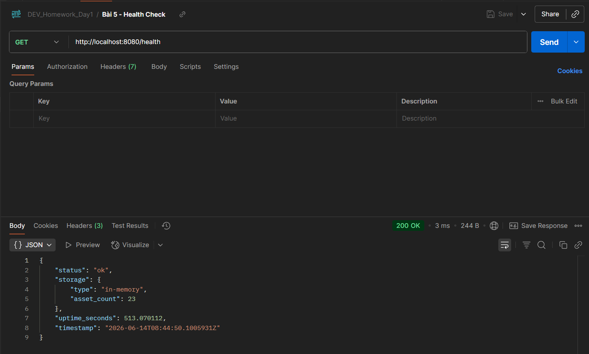

---

### Bài 2: Batch Create

**Tool:** Postman

#### 1. Tạo thành công 3 assets

**Request:** `POST http://localhost:8080/assets/batch`

**Body:**
```json
{
    "assets": [
        {"name": "example.com", "type": "domain"},
        {"name": "192.168.1.1", "type": "ip"},
        {"name": "web-server", "type": "service"}
    ]
}
```

**Output thực tế (201 Created):**
```json
{
    "created": 3,
    "ids": [
        "a50f2fc7-559f-4f0d-a86e-b103197225ae",
        "3dc6a1fe-ab7d-412b-a80f-1567c19affeb",
        "a5c38228-2ce4-489a-8d2a-ead65c296f3a"
    ]
}
```

**Screenshot:**

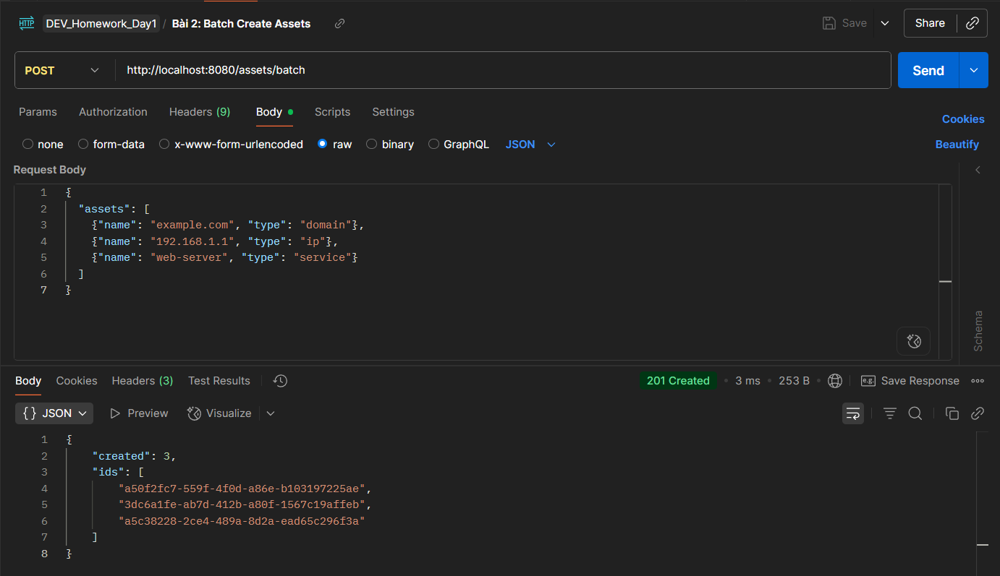

#### 2. Lỗi All-or-Nothing (chứa type không hợp lệ)

**Request:** `POST http://localhost:8080/assets/batch`

**Body:**
```json
{
    "assets": [
        {"name": "good.com", "type": "domain"},
        {"name": "bad.com", "type": "invalid_type"}
    ]
}
```

**Output thực tế (400 Bad Request):**
```json
{
    "error": "invalid asset type: must be domain, ip, or service"
}
```

**Screenshot:**

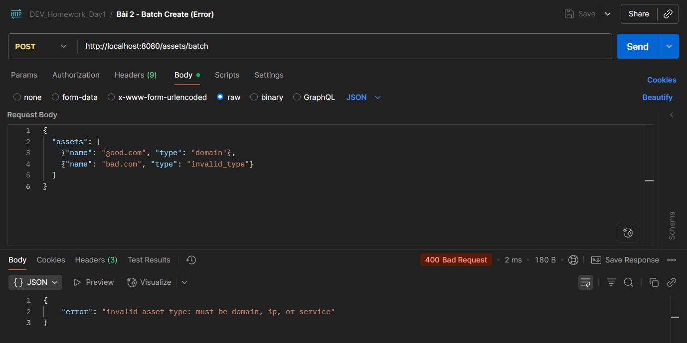

---

### Bài 1: Statistics APIs

**Tool:** Postman

#### 1.1 - Get Assets Statistics

**Request:** `GET http://localhost:8080/assets/stats`

**Output thực tế (200 OK):**
```json
{
    "total": 3,
    "by_type": {
        "domain": 1,
        "ip": 1,
        "service": 1
    },
    "by_status": {
        "active": 3
    }
}
```

**Screenshot:**

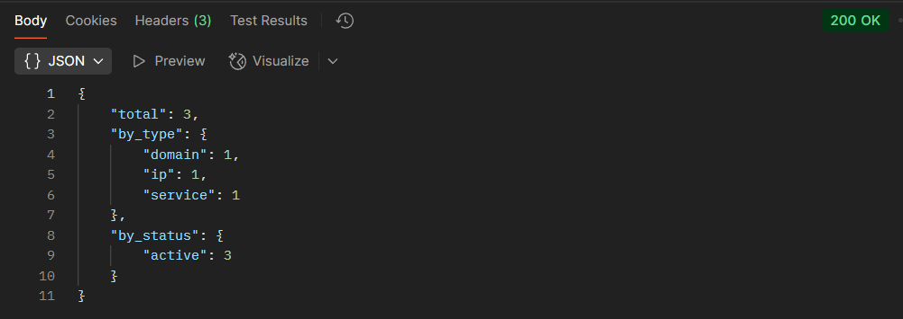

#### 1.2 - Count Assets by Filter

**Request:** `GET http://localhost:8080/assets/count?type=domain&status=active`

**Output thực tế (200 OK):**
```json
{
    "count": 1,
    "filters": {
        "status": "active",
        "type": "domain"
    }
}
```

**Screenshot:**

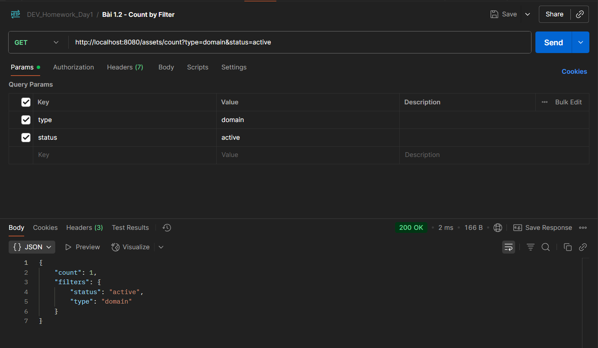

---

### Bài 3: Batch Delete

**Tool:** PowerShell

**Bước 1: Tạo 2 assets nháp và lưu ID**
```powershell
$res1 = Invoke-RestMethod -Uri "http://localhost:8080/assets" -Method POST -ContentType "application/json" -Body '{"name":"delete-me-1.com","type":"domain"}'
$res2 = Invoke-RestMethod -Uri "http://localhost:8080/assets" -Method POST -ContentType "application/json" -Body '{"name":"delete-me-2.com","type":"domain"}'
$ID1 = $res1.id
$ID2 = $res2.id
Write-Host "Created: $ID1, $ID2"
```

**Output:**
```
Created: 48e82e7e-0401-46d6-af54-37cc79e6bb13, d2e06d75-bee9-4fcf-93d5-3f5743c1d998
```

**Bước 2: Batch Delete (2 ID thật + 1 ID giả)**
```powershell
Invoke-RestMethod -Uri "http://localhost:8080/assets/batch?ids=$ID1,$ID2,fake-uuid-123" -Method DELETE
```

**Output thực tế (200 OK):**
```
deleted not_found
------- ---------
      2         1
```

**Screenshot:**

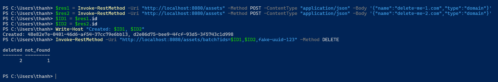

---

### Bài 4: Concurrent-safe Create

**Tool:** PowerShell

**Bước 1: Tạo 20 requests đồng thời bằng background jobs**
```powershell
$jobs = @()
for ($i = 1; $i -le 20; $i++) {
    $jobs += Start-Job -ScriptBlock {
        param($n)
        Invoke-RestMethod -Uri "http://localhost:8080/assets" `
          -Method POST `
          -ContentType "application/json" `
          -Body "{`"name`":`"concurrent-$n.com`",`"type`":`"domain`"}"
    } -ArgumentList $i
}
$jobs | Wait-Job | Out-Null
Write-Host "All 20 requests completed"
```

**Output:** `All 20 requests completed`

**Bước 2: Kiểm tra count (3 ban đầu + 20 mới = 23)**
```powershell
Invoke-RestMethod -Uri "http://localhost:8080/assets/count"
```

**Output thực tế:**
```
count filters
----- -------
   23
```

✅ **Kết quả:** Server không crash, không mất dữ liệu, count đúng 23.

**Screenshot:**

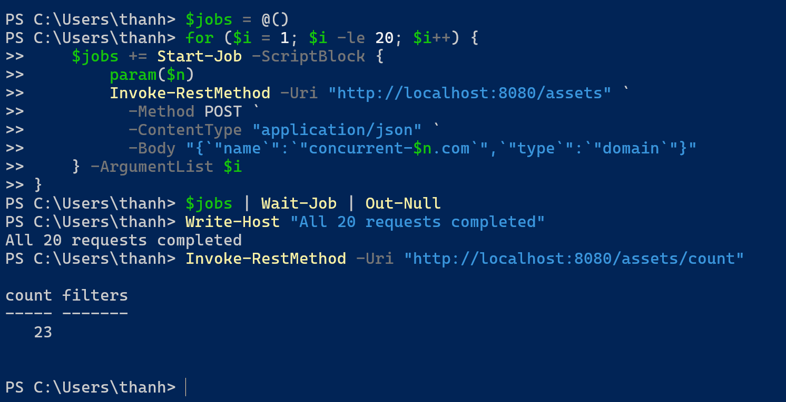

---

### Bài 6: Pagination & Filtering (Bonus)

**Tool:** Postman

#### 1. Phân trang (page=1, limit=10)

**Request:** `GET http://localhost:8080/assets?page=1&limit=10`

**Output thực tế (200 OK):**
```json
{
    "pagination": {
        "page": 1,
        "limit": 10,
        "total": 23,
        "total_pages": 3
    }
}
```

**Screenshot (JSON view):**

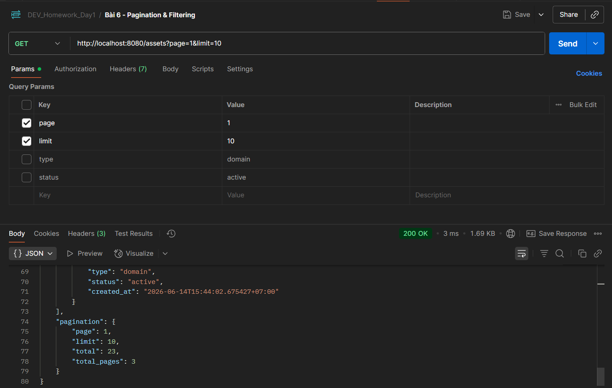

**Screenshot (Preview mode):**

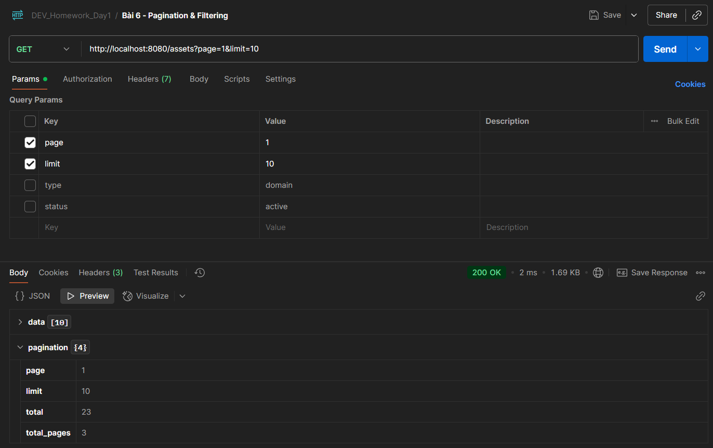

#### 2. Phân trang + lọc (page=2, limit=20, type=domain, status=active)

**Request:** `GET http://localhost:8080/assets?page=2&limit=20&type=domain&status=active`

**Output thực tế (200 OK):**
```json
{
    "data": [
        {
            "id": "a50f2fc7-559f-4f0d-a86e-b103197225ae",
            "name": "example.com",
            "type": "domain",
            "status": "active",
            "created_at": "2026-06-14T15:38:00.6138006+07:00"
        }
    ],
    "pagination": {
        "page": 2,
        "limit": 20,
        "total": 21,
        "total_pages": 2
    }
}
```

**Screenshot:**

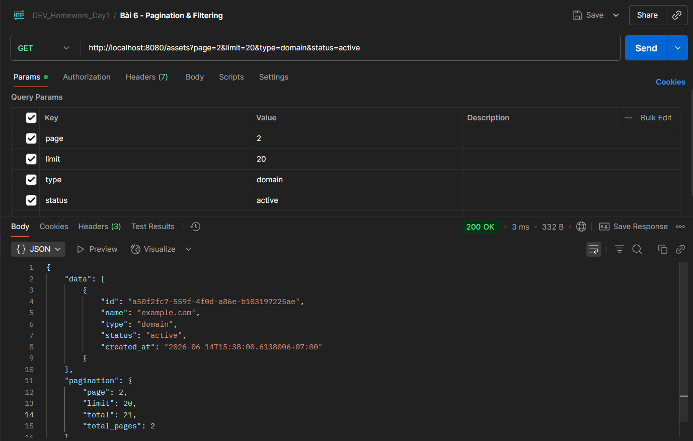

---

### Bài 7: Search by Name (Bonus)

**Tool:** Postman

#### 1. Tìm kiếm theo từ khóa "example"

**Request:** `GET http://localhost:8080/assets/search?q=example`

**Output thực tế (200 OK):**
```json
[
    {
        "id": "a50f2fc7-559f-4f0d-a86e-b103197225ae",
        "name": "example.com",
        "type": "domain",
        "status": "active",
        "created_at": "2026-06-14T15:38:00.6138006+07:00"
    }
]
```

**Screenshot:**

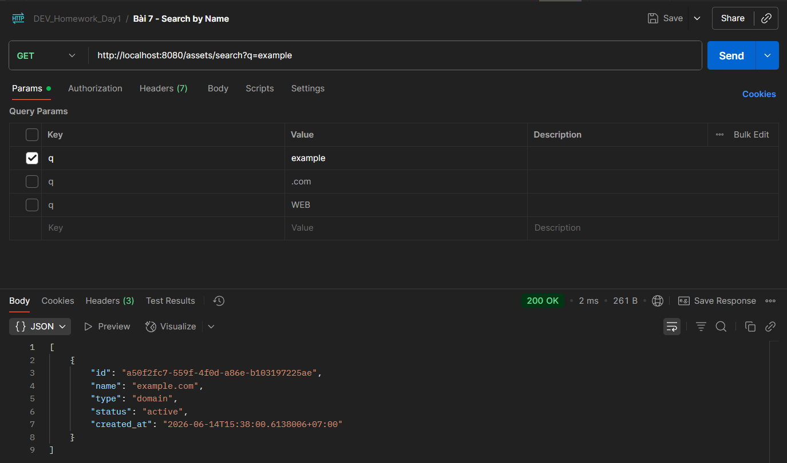

#### 2. Tìm kiếm theo đuôi ".com"

**Request:** `GET http://localhost:8080/assets/search?q=.com`

**Output thực tế (200 OK):** Trả về 21 kết quả (tất cả assets có ".com" trong tên)

**Screenshot (Preview mode):**

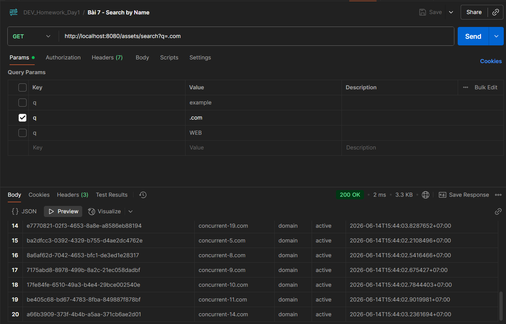

#### 3. Tìm kiếm không phân biệt hoa thường "WEB"

**Request:** `GET http://localhost:8080/assets/search?q=WEB`

**Output thực tế (200 OK):**
```json
[
    {
        "id": "a5c38228-2ce4-489a-8d2a-ead65c296f3a",
        "name": "web-server",
        "type": "service",
        "status": "active",
        "created_at": "2026-06-14T15:38:00.6138006+07:00"
    }
]
```

**Screenshot:**

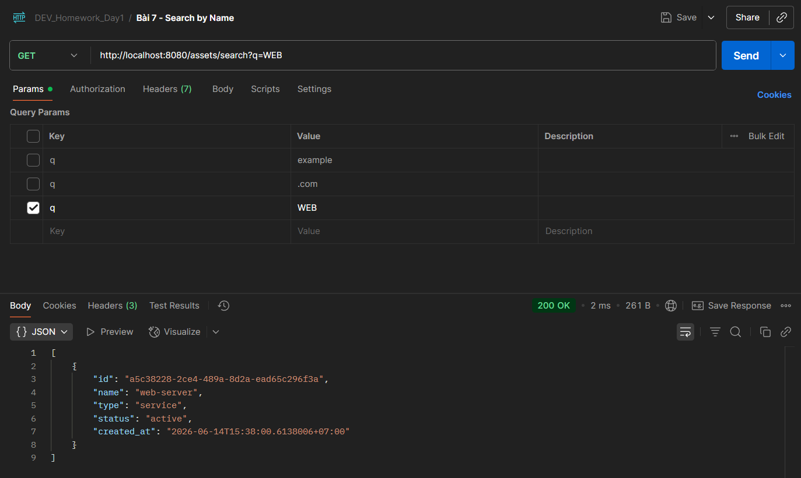
