# Homework Submission - Day 3

**Họ tên:** Tiết Thanh Minh Hiếu

**Ngày nộp:** 21/06/2026

---

## Các bài đã hoàn thành

- [x] Bài 1: Migrate sang Database
- [x] Bài 2: Mở rộng Scan API
- [x] Bài 3: Viết Unit Tests
- [x] Bài 4: Tích hợp Frontend
- [x] Bài 5: CI/CD với GitHub Actions (Bonus)
- [x] Bài 6: Deploy với Docker Compose (Bonus)
- [x] Bài 7: Tính năng EASM mới (Bonus)
- [x] Bài 8: Deploy lên Cloud VM (Bonus)
- [x] Bài 9: Domain & TLS/HTTPS (Bonus)
- [x] Bài 10: Auto Deploy on Merge (Bonus)

## Link Repository

[https://github.com/thanhhieutiet/cmc-dev](https://github.com/thanhhieutiet/cmc-dev)

## Link Demo

[https://hieu-easm.ddns.net](https://hieu-easm.ddns.net)

---

## 📋 Báo Cáo Chi Tiết Từng Bài

---

### Bài 1: Migrate sang Database (30 điểm) ✅

**Mô tả:** Chuyển đổi storage layer từ in-memory sang PostgreSQL. Dữ liệu được lưu trữ bền vững, không mất khi restart server.

**Các nội dung đã thực hiện:**

- Setup PostgreSQL 15-alpine bằng Docker Compose
- Viết 4 file migration SQL (assets, scan_tables, tags, alerts)
- Implement `PostgresAssetRepo` và `PostgresScanRepo` thay thế in-memory storage
- Đọc cấu hình DB từ biến môi trường (`.env`)
- Server tự động chạy migrations khi khởi động
- Xử lý lỗi kết nối DB và retry

**Kết quả minh chứng:**

#### Docker compose ps — PostgreSQL service running

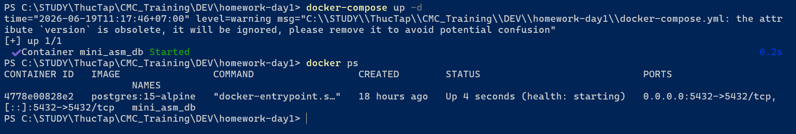

#### Kết nối PostgreSQL và hiển thị bảng dữ liệu

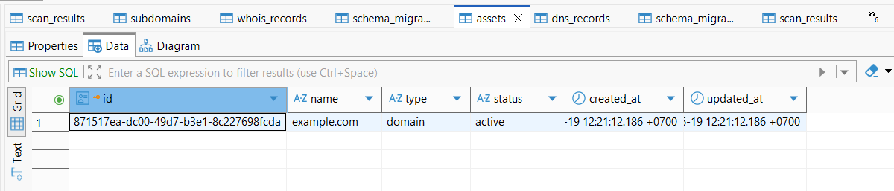

#### Dữ liệu lưu trữ trong DB (vẫn tồn tại sau restart)

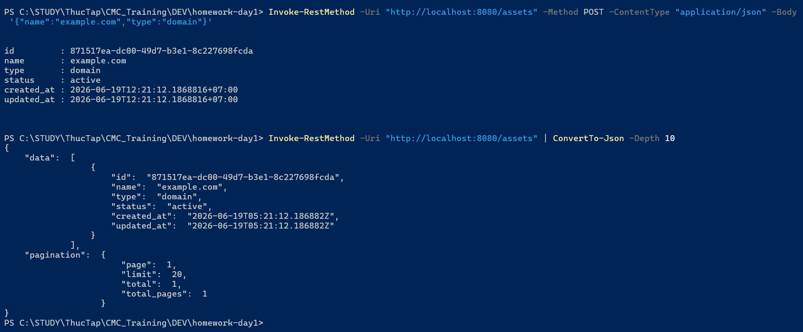

---

### Bài 2: Mở rộng Scan API (25 điểm) ✅

**Mô tả:** Mở rộng hệ thống scan với các loại scan mới: Port Scan, Technology Detection, IP Geolocation, SSL/TLS, ngoài các scan đã có sẵn (DNS, WHOIS, Subdomain, Certificate Transparency, ASN).

**Các scan type đã implement:**

| Scan Type   | Mô tả                          | Asset Type | Trạng thái   |
| ----------- | ------------------------------ | ---------- | ------------ |
| `dns`       | DNS record lookup (A, MX, NS)  | domain     | ✅ Đã có sẵn |
| `whois`     | WHOIS registration info        | domain     | ✅ Đã có sẵn |
| `subdomain` | Subdomain enumeration          | domain     | ✅ Đã có sẵn |
| `ip`        | IP Geolocation & ASN lookup    | ip         | ✅ **Mới**   |
| `port`      | TCP Port Scan (localhost only) | ip         | ✅ **Mới**   |
| `ssl`       | SSL/TLS Certificate Scan       | domain     | ✅ **Mới**   |
| `tech`      | Technology Detection           | domain     | ✅ **Mới**   |
| `all`       | Chạy tất cả scans phù hợp      | domain/ip  | ✅ Đã có sẵn |

**Kết quả minh chứng:**

#### Kích hoạt Port Scan (Active Scan - chỉ localhost)

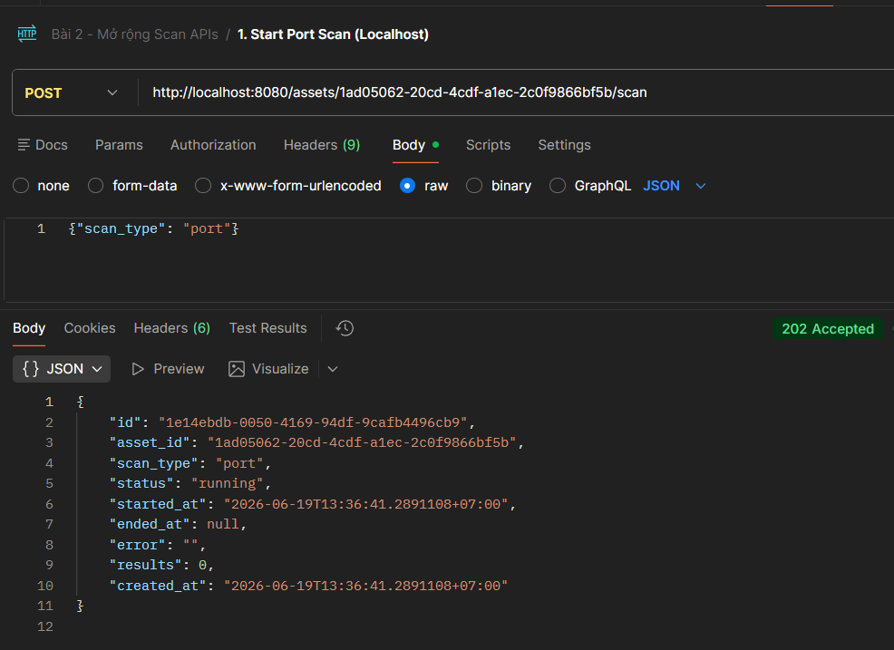

#### Kết quả Port Scan dạng JSON (open ports, services, versions)

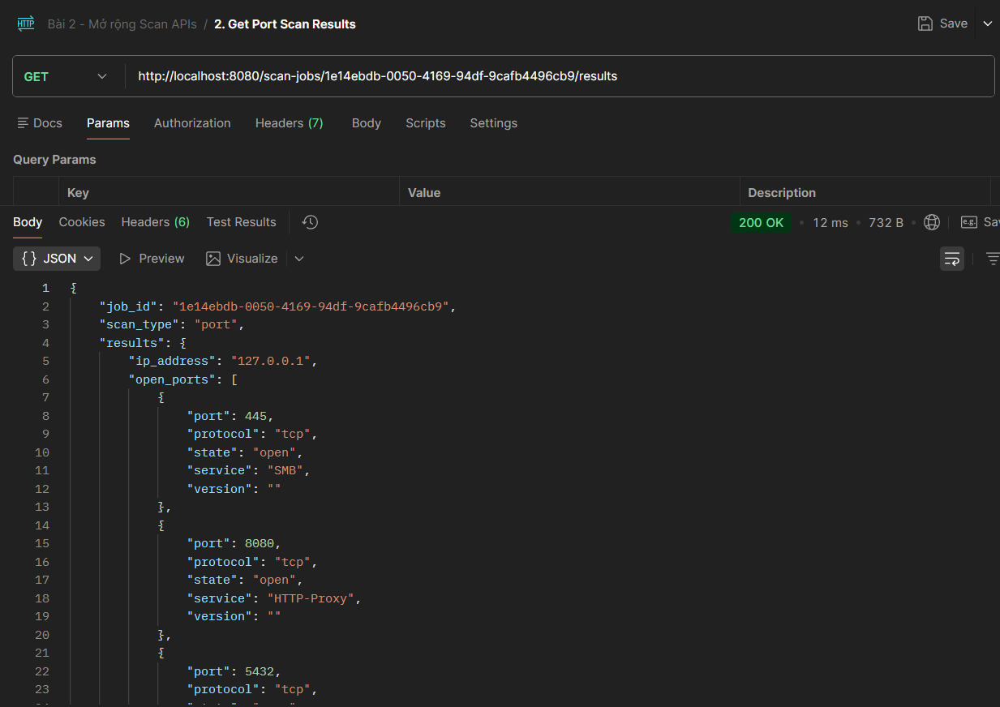

#### Kết quả Port Scan hiển thị trực quan trên giao diện

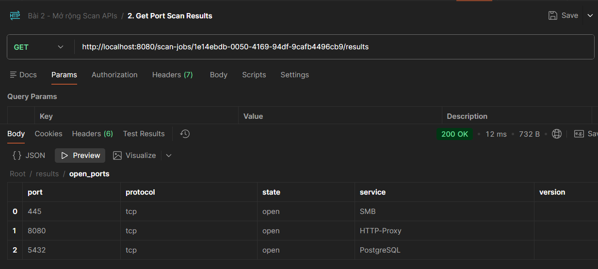

#### Kết quả Technology Detection Scan

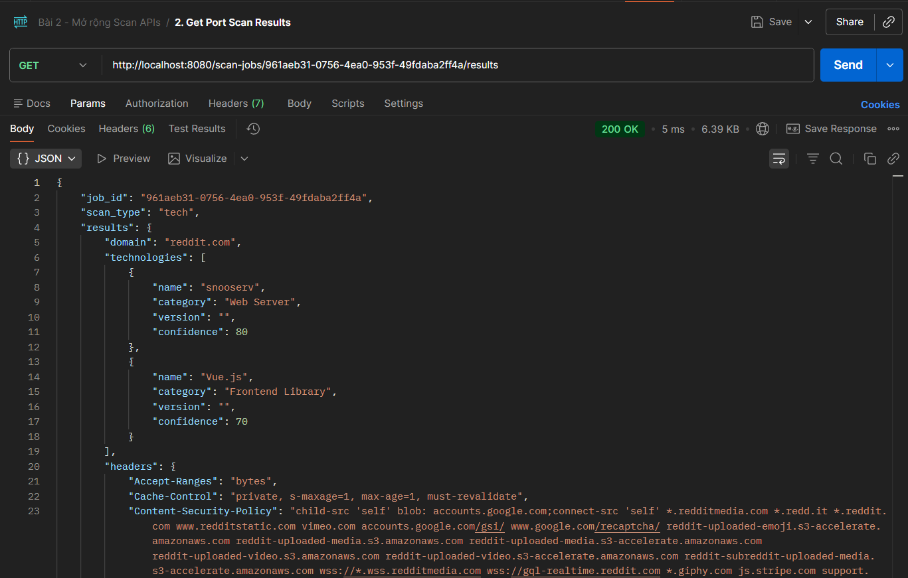

---

### Bài 3: Viết Unit Tests (20 điểm) ✅

**Mô tả:** Viết unit tests toàn diện cho application, bao gồm model validation, scanner tests, handler tests (mock) và service tests (mock).

**Các file test đã viết:**

| File Test                                | Nội dung                              | Loại        |
| ---------------------------------------- | ------------------------------------- | ----------- |
| `internal/model/asset_test.go`           | Validation cho Asset model            | ✅ Bắt buộc |
| `internal/model/scan_test.go`            | Validation cho Scan model             | ✅ Bắt buộc |
| `internal/scanner/dns_scanner_test.go`   | Unit test DNS Scanner                 | ✅ Bắt buộc |
| `internal/scanner/ip_scanner_test.go`    | Unit test IP Scanner                  | ✅ Bắt buộc |
| `internal/scanner/port_scanner_test.go`  | Unit test Port Scanner (safety check) | ✅ Bắt buộc |
| `internal/scanner/ssl_scanner_test.go`   | Unit test SSL Scanner                 | ✅ Bắt buộc |
| `internal/scanner/tech_scanner_test.go`  | Unit test Tech Scanner                | ✅ Bắt buộc |
| `internal/handler/asset_handler_test.go` | Handler test với mock service         | 🌟 Bonus    |
| `internal/service/asset_service_test.go` | Service test với mock storage         | 🌟 Bonus    |

**Kết quả minh chứng:**

#### Tất cả unit tests pass thành công

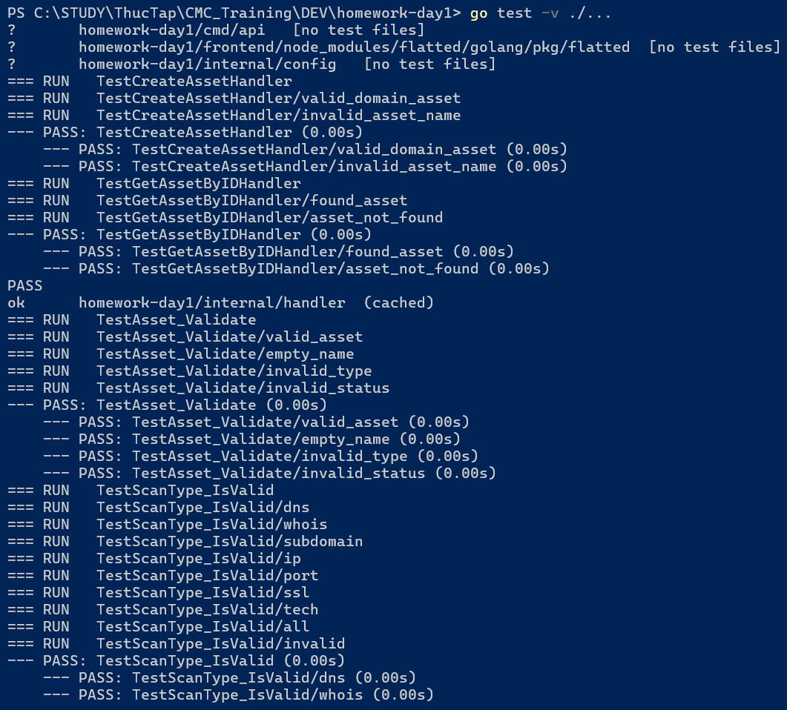

#### Test Coverage Report

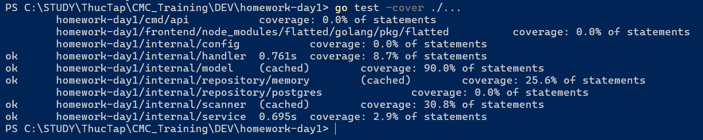

---

### Bài 4: Tích hợp Frontend (20 điểm) ✅

**Mô tả:** Kết nối backend API với giao diện React Portal (Vite). Hỗ trợ Light/Dark mode, Dashboard thống kê, quản lý assets, trigger scan và hiển thị kết quả trực quan.

**Các tính năng frontend đã hoạt động:**

- [x] Hiển thị danh sách assets (phân trang, lọc, tìm kiếm)
- [x] Thêm asset mới (form tạo asset)
- [x] Xóa asset
- [x] Khởi tạo scan (chọn plugin, polling status)
- [x] Xem kết quả scan (Grade SSL, Port list, Tech stack, Geo)
- [x] Dashboard thống kê (số lượng, biểu đồ phân bố)

**Kết quả minh chứng:**

#### Dashboard tổng quan với thống kê

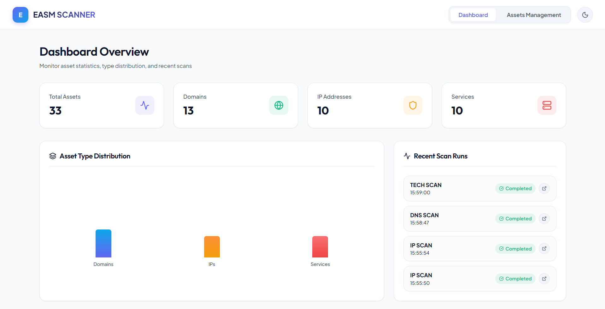

#### Danh sách Assets với data

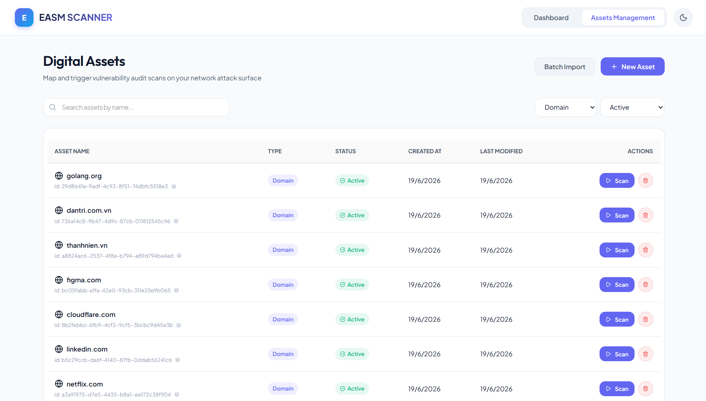

#### Form tạo Asset mới

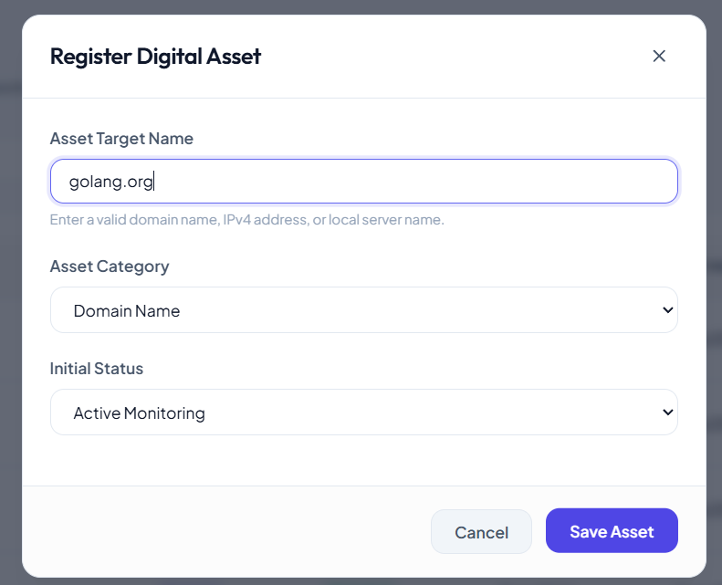

#### Kết quả scan hiển thị trực quan trên UI

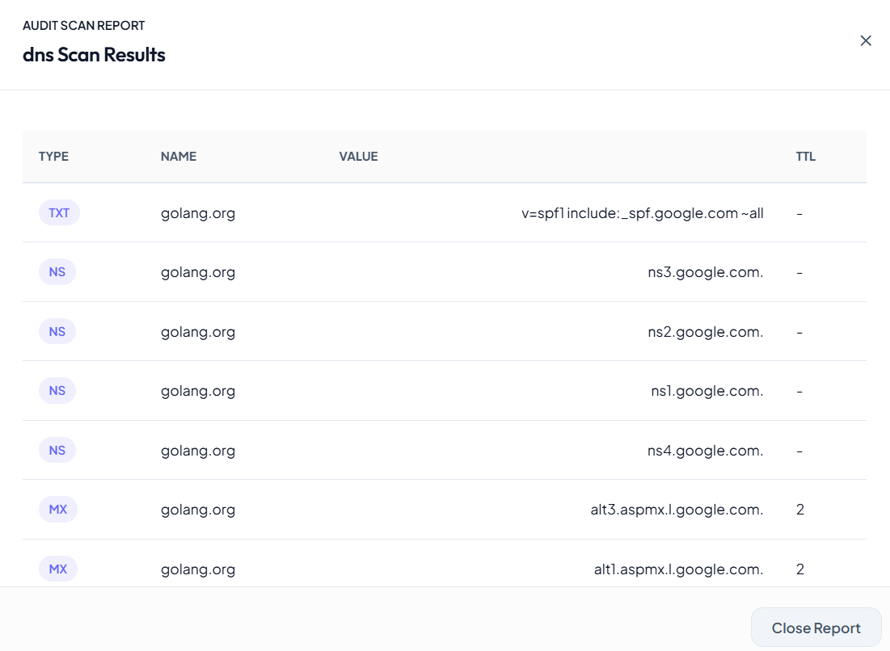

---

### Bài 5: CI/CD với GitHub Actions (25 điểm) — BONUS 🌟 ✅

**Mô tả:** Thiết lập CI/CD pipeline với GitHub Actions, bao gồm unit test, Gosec, Gitleaks, Trivy và TruffleHog.

**Các jobs trong pipeline:**

| Job                  | Mô tả                        | Tool            |
| -------------------- | ---------------------------- | --------------- |
| `Unit Tests`         | Chạy Go unit tests           | `go test ./...` |
| `Gosec Scanner`      | Quét lỗ hổng bảo mật Go code | Gosec           |
| `Gitleaks Scanner`   | Phát hiện secrets trong code | Gitleaks        |
| `Trivy Scanner`      | Quét CVE dependencies        | Trivy           |
| `TruffleHog Scanner` | Quét deep commit history     | TruffleHog      |

**Kết quả minh chứng:**

#### GitHub Actions Workflow đang chạy

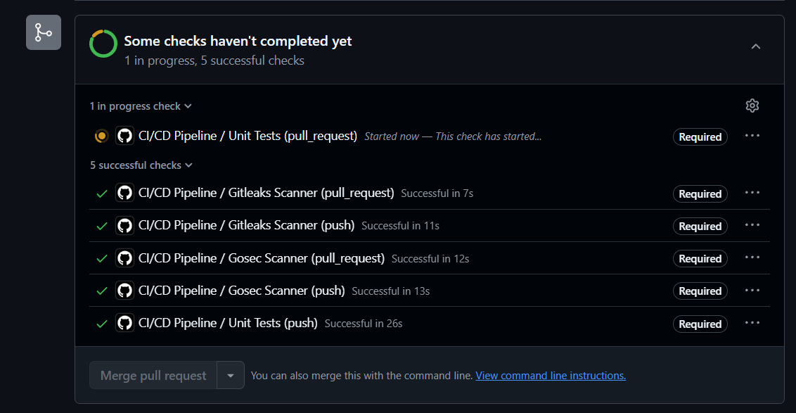

#### Tất cả jobs pass thành công (green checks)

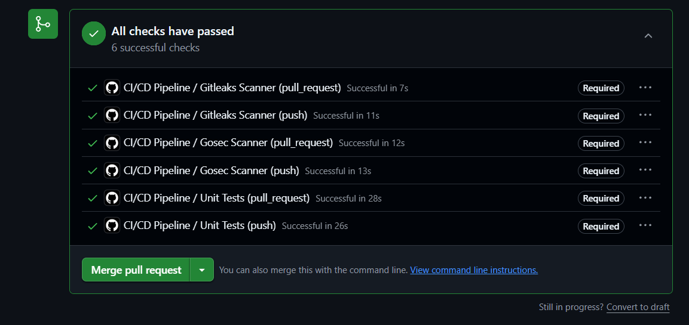

#### Kết quả Security Scan

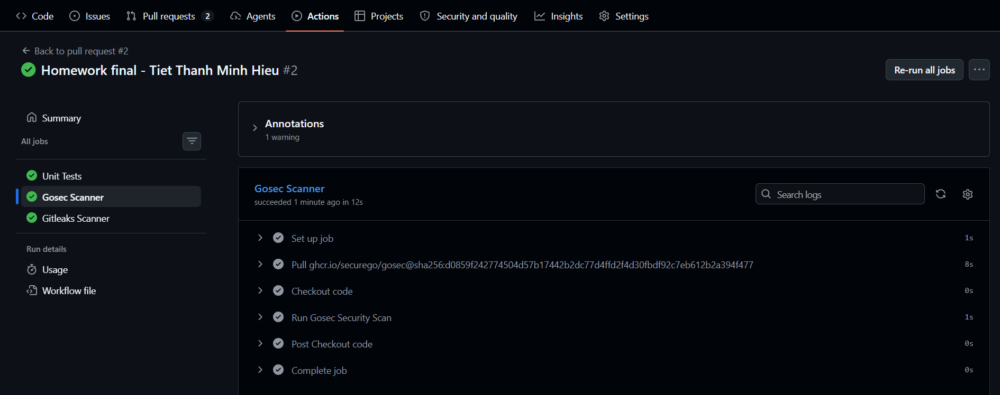

---

### Bài 6: Deploy với Docker Compose (15 điểm) — BONUS 🌟 ✅

**Mô tả:** Deploy full application stack (PostgreSQL + Backend + Frontend) bằng Docker Compose.

**Stack triển khai:**

- `mini_asm_db` — PostgreSQL 15 Alpine
- `mini_asm_backend` — Go API Server (port 8080)
- `mini_asm_frontend` — React + Nginx (port 3000)

**Kết quả minh chứng:**

#### docker compose ps — Tất cả services running

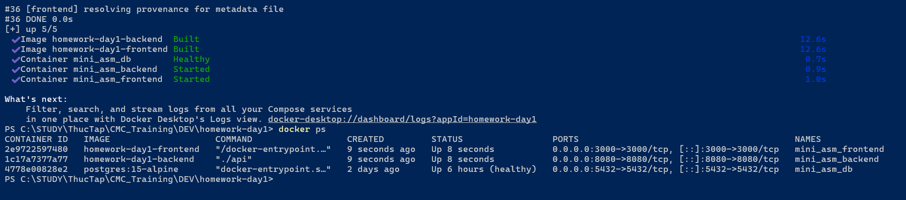

#### Backend health check passing

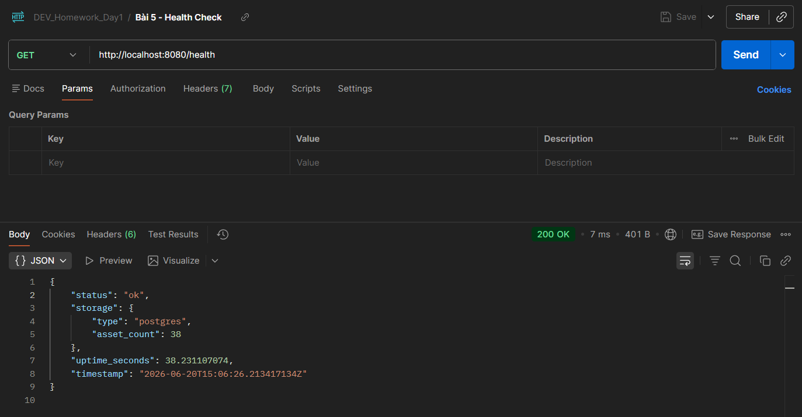

#### Frontend accessible tại localhost:3000

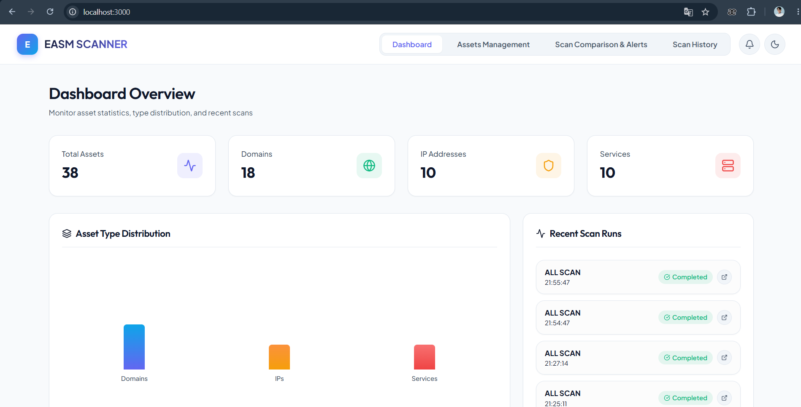

---

### Bài 7: Tính năng EASM mới (15 điểm) — BONUS 🌟 ✅

**Mô tả:** Implement 5 tính năng nâng cao cho hệ thống EASM.

**Các tính năng đã implement:**

#### 6.1 Scheduled Scans — Tự động scan assets theo schedule

Sử dụng Scheduler với interval configurable. Assets có thể bật/tắt auto-scan qua `PUT /assets/{id}/auto-scan`.

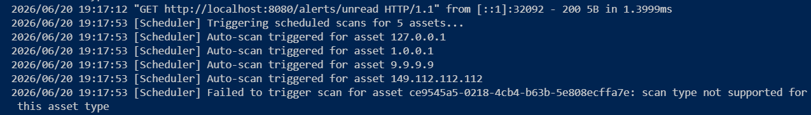
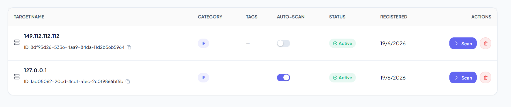

#### 6.2 Asset Groups/Tags — Nhóm assets theo tags

Hỗ trợ gắn tags cho assets để phân nhóm và quản lý.

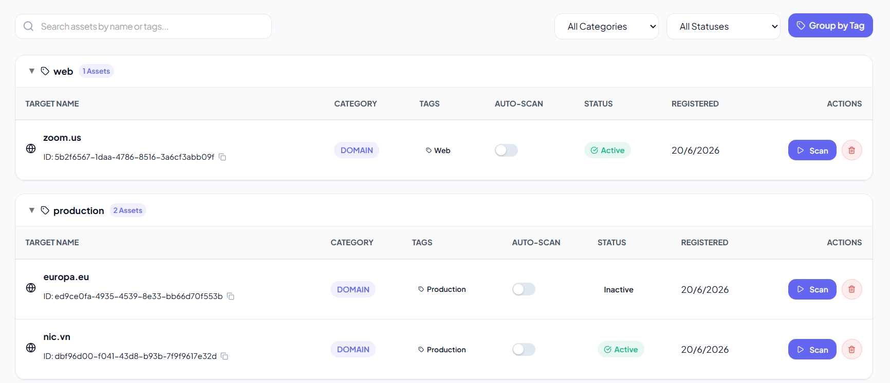

#### 6.3 Alerts/Notifications — Cảnh báo khi phát hiện issues

Hệ thống alerts tự động tạo khi scan phát hiện vấn đề bảo mật (SSL expired, open ports nguy hiểm, v.v.)

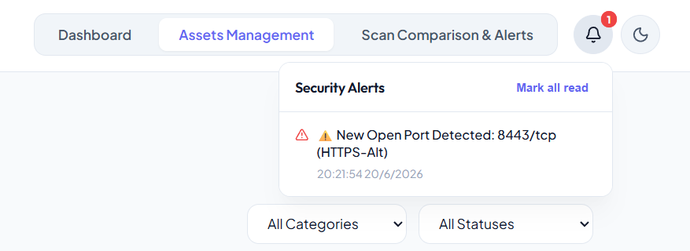

#### 6.4 Scan Comparison — So sánh kết quả scan theo thời gian

So sánh kết quả giữa các lần scan để phát hiện thay đổi.

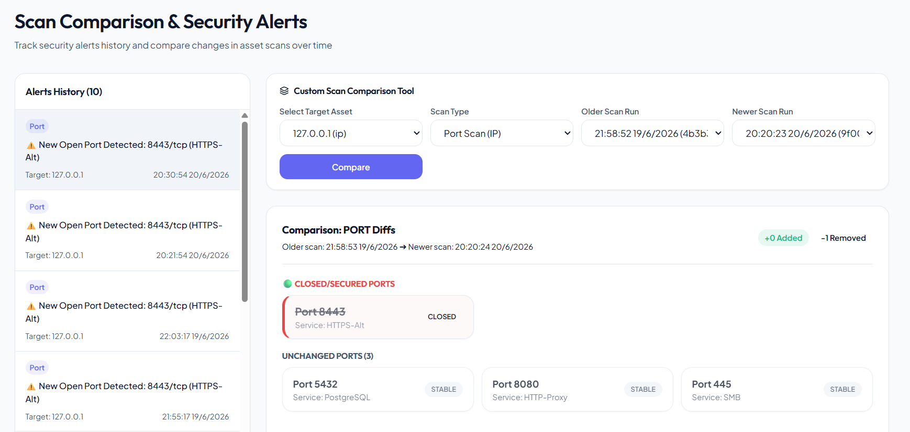

#### 6.5 Export Reports — Export scan results dạng báo cáo

Hỗ trợ export kết quả scan dưới dạng report.

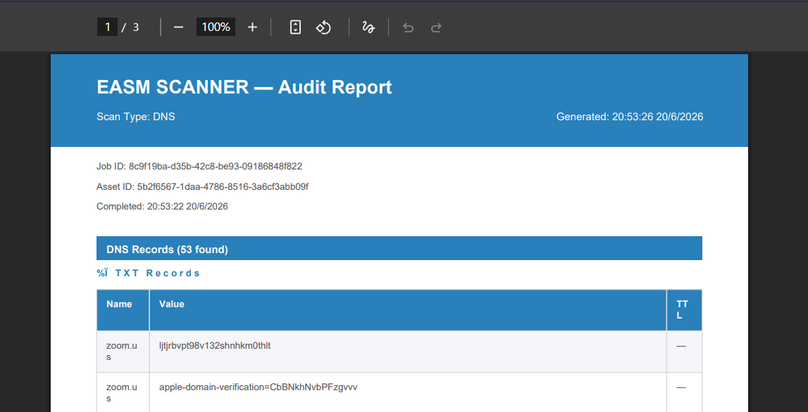

---

### Bài 8: Deploy lên Cloud VM (20 điểm) — BONUS 🌟 ✅

**Mô tả:** Deploy application lên AWS EC2 instance.

**Thông tin triển khai:**

- **Cloud Provider:** AWS EC2
- **Instance Type:** t3.micro (Free Tier)
- **OS:** Ubuntu
- **Software:** Docker + Docker Compose

**Kết quả minh chứng:**

#### SSH connected to VM

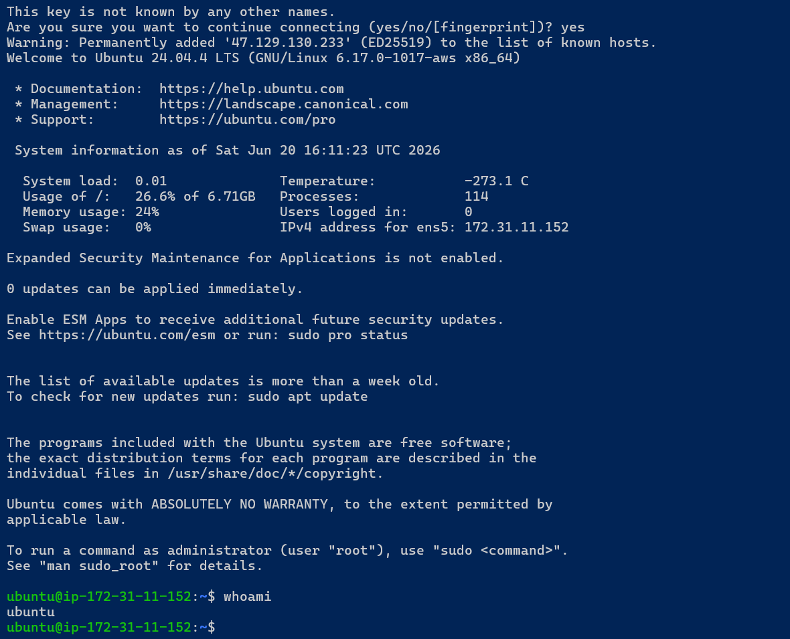

#### Docker containers running on cloud

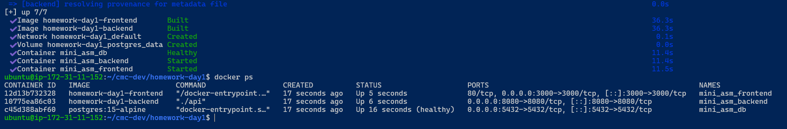

#### Application accessible via public IP

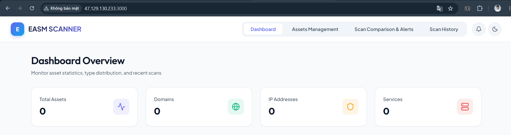

---

### Bài 9: Domain & TLS/HTTPS (15 điểm) — BONUS 🌟 ✅

**Mô tả:** Gắn domain name và cài đặt SSL certificate cho application.

**Thông tin:**

- **Domain:** `hieu-easm.ddns.net`
- **SSL/TLS:** HTTPS enabled
- **Certificate:** Let's Encrypt / Auto HTTPS

**Kết quả minh chứng:**

#### Browser showing HTTPS padlock

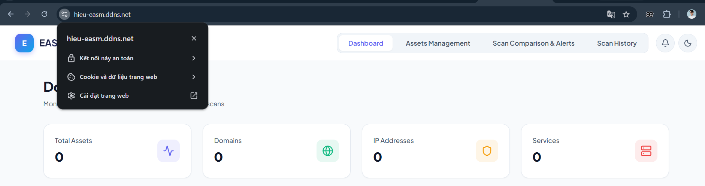

#### Certificate details trong browser

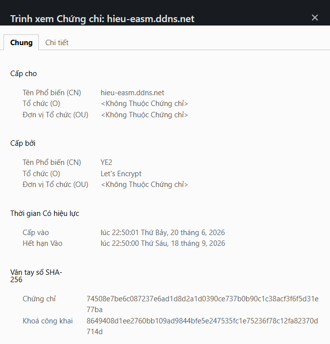

#### curl -I https://hieu-easm.ddns.net output

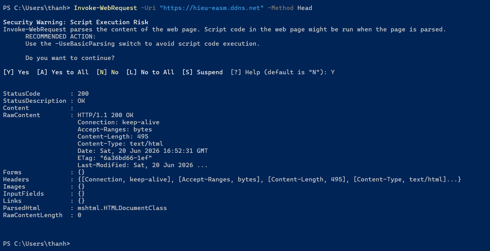

---

### Bài 10: Auto Deploy on Merge (15 điểm) — BONUS 🌟 ✅

**Mô tả:** CI/CD tự động deploy lên server mỗi khi merge thành công vào nhánh `deploy`.

**Workflow:** `.github/workflows/deploy.yml`

- Trigger: Push to `deploy` branch
- Action: SSH vào AWS EC2, pull code, rebuild Docker containers
- Health check: `curl -f https://hieu-easm.ddns.net/health`

**Kết quả minh chứng:**

#### GitHub Actions Deploy Workflow thành công

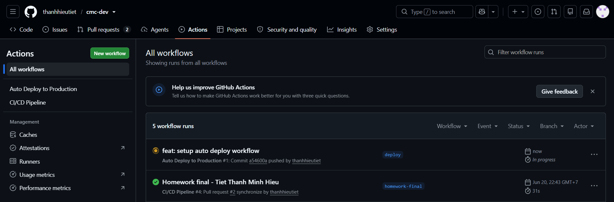

#### Deploy job success

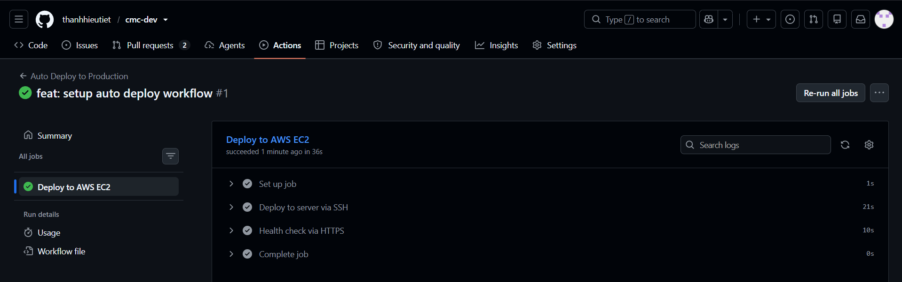

#### Server updated automatically after merge

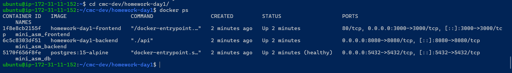

---

## 📊 Tổng Kết Điểm

| Bài Tập                      | Điểm Tối Đa | Hoàn Thành |
| ---------------------------- | ----------- | ---------- |
| Bài 1: Migrate sang Database | 30          | ✅         |
| Bài 2: Mở rộng Scan API      | 25          | ✅         |
| Bài 3: Viết Unit Tests       | 20          | ✅         |
| Bài 4: Tích hợp Frontend     | 20          | ✅         |
| Bài 5: CI/CD GitHub Actions  | 25          | ✅ Bonus   |
| Bài 6: Deploy Docker Compose | 15          | ✅ Bonus   |
| Bài 7: Tính năng EASM mới    | 15          | ✅ Bonus   |
| Bài 8: Deploy Cloud VM       | 20          | ✅ Bonus   |
| Bài 9: Domain & TLS          | 15          | ✅ Bonus   |
| Bài 10: Auto Deploy          | 15          | ✅ Bonus   |
| **Tổng**                     | **200**     | **10/10**  |
